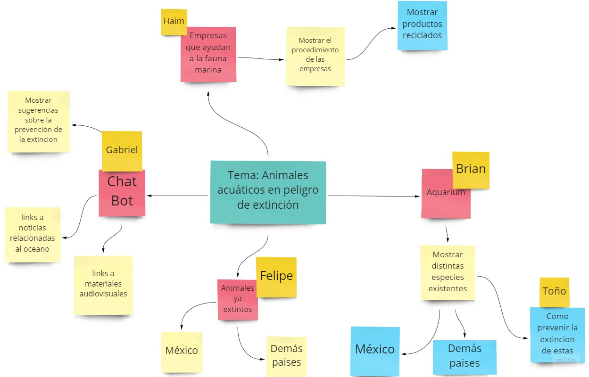
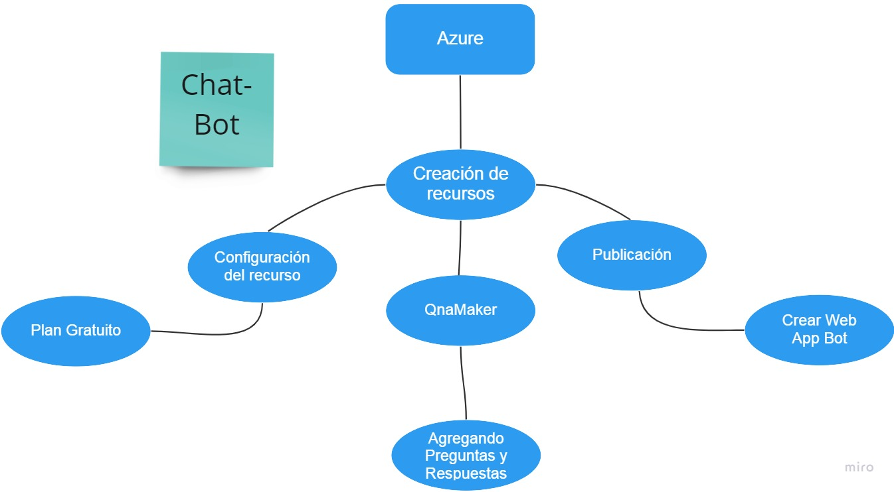
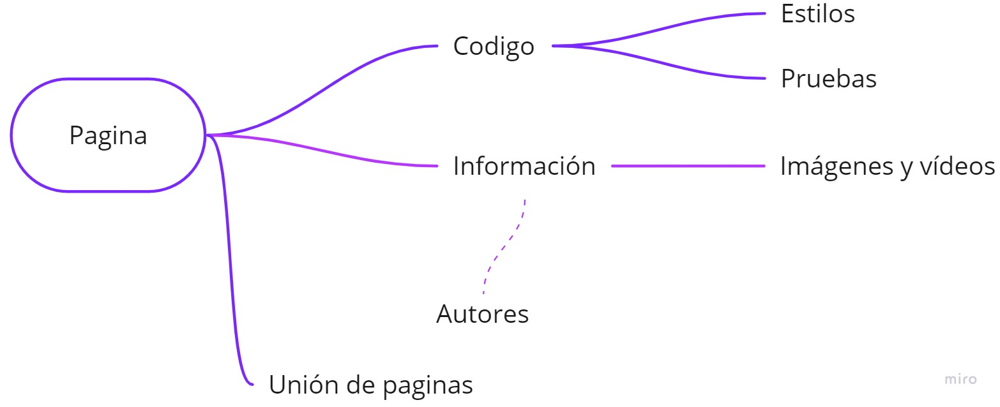
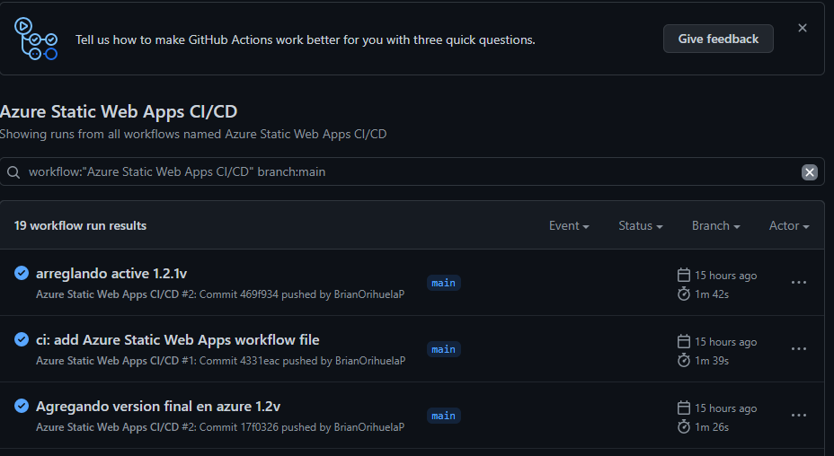

# HACKATON---HACK-THE-OCEAN
Repositorio con la solución del hackaton

| Proyecto | Práctica | Link al repo |
| ------------- |:-------------:| -----:|
|`Toma de requerimientos`|1|Archivos adjuntos en este repo|
|`Webpage`|2|[Link al repo](https://github.com/BrianOrihuelaP/Hackaton-Web-Page)|

## Pasos en la elaboracion del proyecto:

1. Identificar Problematica.
2. Propuesta de solucion.
3. Levantamiento de requerimientos
4. Herramientas a utilizar
5. Desarrollo de pagina web.
6. Proyecto Finalizado con problematica y propuesta de solucion.

### 1.Identificación de Problema.

* En nuestro Caso decidimos enfocarnos en los animales marinos en peligro de extincion, investigamos acerca de esta problematica y nuestra sorpresa es que casi no hay sitios web que se enfoquen en este problema y den la suficiente informacion para poder hacer algo al respecto.
> Sabemos que este no es el unico problema que presenta el oceano.

>Foto de Wexor Tmg en Unsplash

### 2.Propuesta de solución.

* Crear una pagina web con toda la informacion respecto a los animales marinos que se encuentren en peligro de extincion al igual que los animales marinos que se extinguieron, pero no solo es una pagina web con puro texto que ni siquiera te tomarias el tiempo en leer, se construira con informacion relevante que vaya al grano sin tantos rodeos.
* contara con un diseño llamativo y sencilla de navegar en ella para que todas las personas puedan utilizar, ademas de contar con un chat que te puede ayudar con algunas preguntas y/o dudas que tengas al respecto.

### 3.Levantamiento de requerimientos.
1. Primero se utilizo un ***Formato de requerimientos*** proporcionado por LaunchX para la primera mision de Front-End. Para llenar este documento se realizo una llamada para estar de acuerdo en todos los aspectos o de noser asi en la mayoria.
> El formato se encuentra en este Repositorio ya llenado con lo solicitado.
2. Se creo el ***Buyer Persona.***
* Se creo en base al tipo de persona que esta relacionado con la problematica como lo son los dueños de empresas u Hoteles en las costas y que contaminan los oceanos.
> El formato se encuentra en este Repositorio ya llenado con lo solicitado.
3. Se creo el ***Target Audience.***
* Se considero el publico que esta mas relacionado con el oceano y tambien los que mas contaminan , pero tambien las personas y empresas que pueden ayudar a resolver esta problematica.
> El formato se encuentra en este Repositorio ya llenado con lo solicitado.
4. Se Utilizo la ***Paleta de colores.***
* Con [Palette Coolors](https://coolors.co/) buscamos la paleta de colores a utilizar y es en base al la temática del oceano, por lo que el equipo optó por usar la siguiente paleta de colores para el diseño de las paginas.

### 4.Herramientas a utilizar

* Azure: para la creacion del chat y dezpliegue del sitio web estatico.
* Git: para versionar el proyecto.
* Miro: para el analisis del problema.
* Palette Coloors: para el diseño de la pagina web.
* VsCode: Donde se introdujo el codigo que llevaria la pagina web.

### 5.Desarrollo de la Pagina web.

1. Lo primero fue hacer un analisis sobre como llevar a cabo el problema, y como introducir al usuario a dichos temas, con ayuda de las herramientas antes mencionadas como miro, analisis en cuanto a que publico queremos llegar, crear nuestr buyer persona asi como un analisis de toma de requerimientos, de esta manera se pudo llevar a cabo el proyecto, asi el trabajo en equipo se llevo y controlo de mejor forma.

2. Estructura de la Pagina Web

3. Creacion de un repositorio en Github.
* En esta parte ya se ha implementado parte del codigo y para poder visualizarlo en conjunto se creo un repositorio en Github, en este repositorio se ven los cambios realizados al igual que se desplego un github action para poder visualizar la pagina web en plena fase de desarrollo.
>El repositorio esta indicado en el principio de este archivo.

4. Creacion del Chat-Bot.

* Gracias a la ayuda de ***Azure*** pudimos crear un chatbot con mucha facilidad.
* Lo primero fue la creacion del recurso que utilizaremos y nombrar nuestro chatbot.
* Despues nos redireccionamos a otra pagina de azure donde se encuentra ya creado nuestro recurso pero esta vacio, entonces agregaremos nuestra preguntas que se nos ocurrieron las personas podrian hacerle, y tambien le introdujimos las respuestas a dichas preguntas.
* Al finalizar de agregar las preguntas y respuestas necesitamos publicar dicho servicio y crear una web app para consultar el codigo de dicho chatbot para poder colocarlo en nuestra pagina web.

5. Contenido de las paginas.
* Despues de añadir el codigo necesario se comienza a ñadir la informacion que nosotros consideramos de suma importancia para erradicar el problema y hacer conciencia en las personas.
* Tambien se le añadieron imagenes y videos relacionados al tema propuesto junto con sus autores de dicho material al igual que con la informacion se coloco de donde fue extraida.

6. Deploy en azure con static web apps

### 7.Proyecto Finalizado.

Link a la pagina "https://green-sea-0482ba110.1.azurestaticapps.net"

