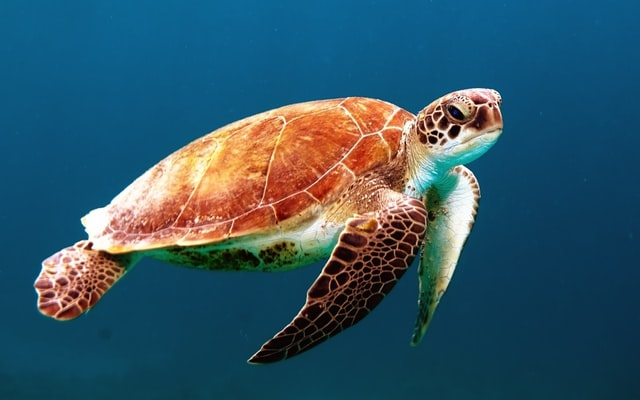

# HACKATON---HACK-THE-OCEAN
Repositorio con la solución del hackaton

| Proyecto | Práctica | Link al repo |
| ------------- |:-------------:| -----:|
|`Toma de requerimientos`|1|[Link al repo](https://github.com/BrianOrihuelaP/RequerimientosHacktheOcean)|
|`Webpage`|2|[Link al repo](https://github.com/BrianOrihuelaP/Hackaton-Web-Page)|

## Pasos en la elaboracion del proyecto:

1. Identificar Problematica.
2. Propuesta de solucion.
3. Levantamiento de requerimientos
4. Herramientas a utilizar
5. Desarrollo de pagina web.
6. Proyecto Finalizado con problematica y propuesta de solucion.

### 1.Identificación de Problema.

* En nuestro Caso decidimos enfocarnos en los animales marinos en peligro de extincion, investigamos acerca de esta problematica y nuestra sorpresa es que casi no hay sitios web que se enfoquen en este problema y den la suficiente informacion para poder hacer algo al respecto.
> Sabemos que este no es el unico problema que presenta el oceano.

>Foto de Wexor Tmg en Unsplash

### 2.Propuesta de solución.

* Crear una pagina web con toda la informacion respecto a los animales marinos que se encuentren en peligro de extincion al igual que los animales marinos que se extinguieron, pero no solo es una pagina web con puro texto que ni siquiera te tomarias el tiempo en leer, se construira con informacion relevante que vaya al grano sin tantos rodeos.
* contara con un diseño llamativo y sencilla de navegar en ella para que todas las personas puedan utilizar, ademas de contar con un chat que te puede ayudar con algunas preguntas y/o dudas que tengas al respecto.

